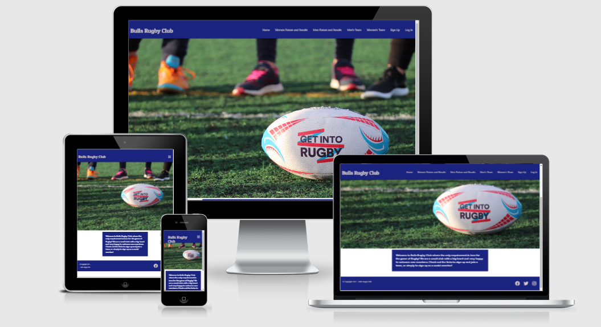

# Bulls Rugby Club
## Introduction

The purpose of this website is to provide an online presence for a Rugby club.
The site will contain information about the club in general, latest fixtures and 
results and team details. Users will have the option to join the club.
This can be as a player where details on gender and playing position are gathered along with a profile pic,
or as a volunteer or social member. 
As a player, the user will be able to elect availability for each match.
The user that is the "manager", will be able to input games in the schedule, update results and delete games.
This "manager", will also have visibility on the players availability.
For assessment purposes and testing purposes, the manager is already created. Username and  password are both "manager".

## User Stories

### First Time Users

+ I want to get an overview of the club
+ I want to see latest fixtures and results related to the club teams
+ I want the option to join the club
+ I want the option to join a team in the club

### Returning Users

+ I want to be able to log in
+ I want to be able to edit my game availability
+ I want to see latest fixtures and results related to the club teams

### Manager Users

+ I want to be able to update latest results
+ I want to be able to view all player availability for games
+ I want to be able to remove games from the schedule
+ I want to grow the club membership
+ I want to keep up to date on team memebership

#### Site Owner

+ I want to attract and retain players and supporters
+ I want a site where users can get information on the club teams
+ I want players to be able to register for a team
+ I want players to be able to opt in for availability for games
+ I want the team manager to be able to see player availability
+ I want the team manager to be able to set the game schedule
+ I want the team manager to be able to update results and remove games

## UX

### Strategy Plane

The site is the online representation of a rugby club. The club manager must be able to 
run the site overall, as is the case with the actual club. New members  must be 
able to join and optionally select a team as a player. Returning players must 
be able to log in and edit their game availability. 

### Scope Plane

The scope of the site is to allow the manager to run the site in terms of content and
 the users to become members, edit their own information only and keep up to date
 in club affairs. 
 The site will include:
 + Home page with club overview
 + Team fixtures and results - both men and women
 + Team details - both men and women
 + Log in option for members
 + Join option for new users
 + Option to join a team as a player
 + Option for players to select game availability
 + Option for the manager to schedule games, update results and delete games

### Structure Plane

#### Frontend

The site will be structured in a consistent manner. The NAV bar will contain 
the menu options as relevant to the user:
+ Home
+ News
+ Men's Rugby
+ Women's Rugby
+ Sign Up / Log Out
+ Log In / Log Out

[Home Wireframe](readme_images/home.png)

[Fixtures and Results Wireframe](readme_images/fixtures_results.png)

[Team Wireframe](readme_images/team-details.png)

[Sign Up Wireframe](readme_images/signup.png)

[Login Wireframe](readme_images/login.png)

[Game Scheduler Wireframe](readme_images/game_fixture.png)

[Match Team Wireframe](readme_images/match_team.png)

[Update Score Team Wireframe](readme_images/update_score.png)

[Game Available selection Team Wireframe](readme_images/player_availability.png)

#### Backend

The database used is MongoDB. It is a non relational file based.
There are three collections:

1. Users
2. Game Schedule
3. Player Availability

[Database Wireframe](readme_images/database_design.png)

##### Users

This allows a new user to become a member of the club. The name and password
are captured for log in.
Where membership type of "Player", is selected, the user will be 
directed to the player form where playing position and gender must be selected.
Gender will direct to the relevant team.
The options of "Volunteer", and "Social", are for the club management to use for event organisation.

##### Game Schedule

This will be populated via front end form only available to user "manager"
 where game fixtures can be set,
results edited, and games deleted if necessary.
This collection will be used to populate the relevant pages fixtures and results.

##### Player Availability

This will be populated via front end form only available to users that are type "player". 
It will be joined using an aggregate function to take players full names for display on 
match team page only available to user "manager".

### Skeleton Plane 

The site will have 5 standard pagers for all users.
Players will have a form to opt in or out for game availability.
Manager will have two pages extra to all others to set game schedules and view players available.
Manager will have a form to edit game results. 

### Surface Plane

The site's colors, typography and layout will be consistent and in line with the club's colors.
The main club colors are red and blue, and this is reflected on the site. 

## Features

### Current Features

+ The site will allow new users to join.
+ The site will allow returning users to log in.
+ The site will allow users to elect as a player and join a team.
+ The site will allow players to elect availability for matches on the schedule.
+ The site will allow players to change decision on availability with update captured in database without duplication.
+ The site will allow only the "manager", to set games in the schedule.
+ The site will allow only the "manager", to edit the game results.
+ The site will allow only the "manager", to delete games from the schedule.
+ Users can view team members for details of playing position and profile picture.
+ Users can view team game history with results and any upcoming fixtures.
+ Manager can view players available. 

### Feature breakdown

The color scheme is primarily blue and red in keeping with club colors.
The base html contains a header and footer that will be available on all pages for consistency.
The header includes the club name and a NAV bar. This collapses on mobile devices to a burger for ease of use.
The footer contains the club copyright and the social media links (links just go to homepages of social media for now).

The following menu options are available without being logged in:

+ Home
+ Women Fixtures and Results
+ Men Fixtures and Results
+ Men's Team
+ Women's Team
+ Sign Up
+ Log In

Logged in as a player, there is a button in the relevant "Fixtures and Results", page pending gender, to 
select game availability.

Logged in specifically as "manager", the following additional menu items are available:

+ Game Schedule
+ Match Team

In addition, user "manager", has a button to "Edit", and "Remove", games in the "Fixtures and Results", pages.

#### Home page

The home page contains a hero image and a short paragraph on the club. 

#### Fixtures and Results

These pages output the details of past games with results and future games from the database.
There is a button when logged in as a player to select game availability. This brings the user to 
a form where the date is taken from the database of games not yet played known by result being "TBC".
+ The user can select available or unavailable for each date. Selecting available will trigger the option on where
 to meet the team. On submission, the form empties and user can update another record or use NAV bar to navigate site.

There are two buttons under each fixture when logged in as "manager", to edit the score or remove the game. 
+ Clicking "Remove" removes the record from the database and takes "manager", to Game Schedule form / page. 
+ Selecting "Edit", takes "manager", to a form to input the game result and on submission brings the "manager", back to Home.

#### teams

+ These pages display details of the players that make up the squad for each team. 
+ It includes a profile pic, name and playing position.

#### Sign up

The signup form contains the following fields:

+ Username - must be unique and handled in python to check against database
+ Password - werkzeug hashing implemented so password is unreadable in database. Also must be 5 to 15 characters and can contain
  alpha lower and upper case, and numbers.
+ First Name - string 
+ Last Name - string
+ Membership type - dropdown with option for "volunteer", "social member", or "player"

If option for "player selected, the following fields become visible and are required:

+ Gender - dictates which team the player is assigned to.
+ Position - dropdown to select playing position.
+ Profile Pic - profile pic for player to upload (it is URL based now but in future I would like to enhance with file upload)

If user attempts to add an existing username, a flash message advises "Username already exists"
On selecting a unique username and clicking submit, the newly signed up member is taken to the Log In page.

#### Log In

The Log In form contains the following fields:

+ Username
+ Password

If user enters incorrect details, a flash message advises "Incorrect Username and / or Password"
On correct credential entry and submission, user is taken to Home page with flash message "Welcome, username"

#### Game Availability

This form is available to users of type player only. It is launched via button on the respective "Fixtures 
and results screen. It contains the following fields:

+ Game date drop down for games not yet played, denoted by scoreline "TBC"
+ Option to select "Available", or "Unavailable"
If "Available", is selected, an option on where to meet the team is presented.
On submission, the user receives a flash message "Successfully entered availability!" and the form clears.

#### Game schedule

This page is available only to user "manager". The form has the following fields:

+ Team - dropdown option for "Men", or "Women"
+ Date - date picker
+ Opposition - string field to capture opposition team name
+ Venue - string field to capture gaame venue

On submission, the user receives a flash message "Game Fixture Entered!" and the form clears.

#### Match Team

This page is available only to user "manager". It returns details from the game availability collection and 
joins to the user table to present the names of the players that are available and unavailable for 
the various games.

#### Future Features

+ Ability for manager to dynamically organise team based on availability selection.
+ Email integration to auto send mails to players when new fixture entered by "manager".
+ Email integration to auto send mails to team members selected.
+ League table to integrate with results data. 
+ Ability for social members to vote for "player of the match", for each game.
+ Ability for volunteers to opt in for jobs in the club. This will require implementation of tasks that can be optionally taken, 
  e.g., groundskeeping, etc and dates supplied.

## Technologies used

#### Frameworks, Tools and Libraries

+ Materialize
+ Font Awesome
+ Google Fonts
+ Balsamiq
+ Github
+ MongoDB
+ Cloudinary for image storage

#### Languages

+ HTML
+ CSS
+ JavaScript
+ Python
+ Jinja

#### Tools

+ Github as version control
+ Heroku to host the site and application
+ Chrome deverloper tools for on going testing
+ Am I responsive to check site responsiveness
+ W3C Markup and CSS validators
+ PEP8 on line validator

## Testing

[Testing file](TESTING.md)

## Deployment

#### Application Deployment

The application is deployed on Heroku. This was accomplished by the following:

+ Create a requirements.txt file and a Procfile
+ Track these two files by committing to GitHub
+ Go to Heroku and create a new application
+ Navigate to the app and deploy using "GitHub" and link to the relevant repository, in this case "TomDillane/bulls_rugby_club"
+ Go to settings in Heroku and select "Reveal Config Vars"
+ Populate the following fields:

[Heroku config pic](readme_images/heroku.config.png)

+ IP - set to 0.0.0.0
+ MONGO_DBNAME - set to bulls_rugby which is the name of the database
+ MONGO_URI - to get this, go to MONGODB Clusters, select "Connect", and choose "Connect your application"
+ Copy the string and replace password and database name
+ Port - set to 5000
+ SECRET_KEY - set to secret key as per key generated and used in untracked file env.Python

+ Finally, navigate to "Deploy" and ensure that the master branch is selected

#### Run Locally

To run locally, you need to install the following tools:

+ PIP
+ Python3
+ GitHub
+ Create an account at MongoDB

- Go to GitHub and navigate to the main page of the repository (https://github.com/TomDillane/bulls_rugby_club)
- Click the "Code", drop down.
- Click the "Copy", icon next to the url.
- Install Github on your machine and launch the repository that you wish to use.
- Open Git Bash and navigate to where you want to put the clone.
- Type git clone https://github.com/TomDillane/bulls_rugby_club
- Press "Enter".
- In bash, enter "pip3 install requirements.txt"
- To run the app locally, enter "python3 app.py", in bash

## Credits

+ The profile pictu0res I have used are from pexels.com
+ The hero image is from unsplash.com
+ I used Cloudinary.com to store the profile pics
+ I used Materialize for the built in classes and Frameworks
+ I used mongodb for my database

All content was written by Tom TomDillane

### Acknowledgements

I would like to thank my mentor for the support in this project.

